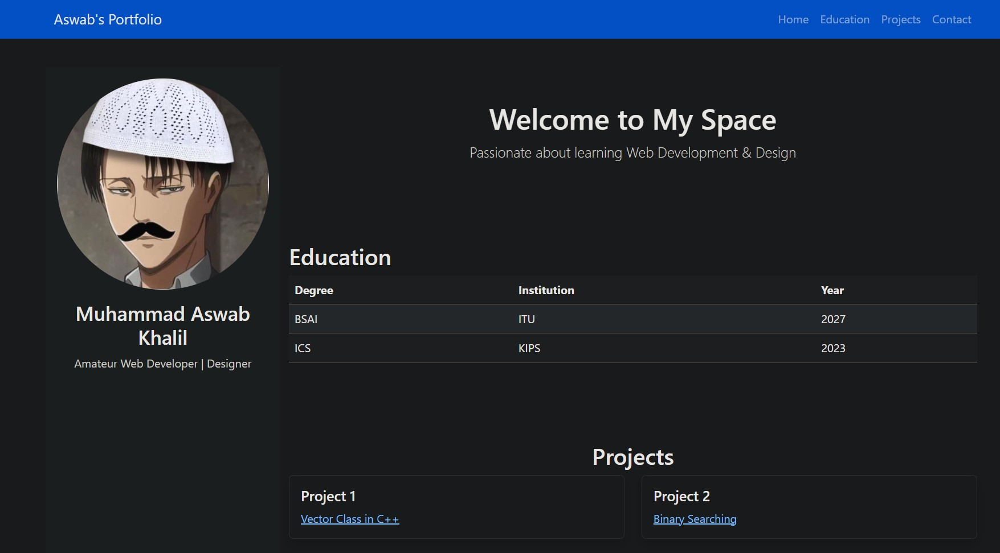

# Portfolio Website

## Overview
This is a personal portfolio website showcasing my education, projects, and contact details. The website is built using HTML, CSS, and Bootstrap.

## Features
- **Navigation Bar:** Provides links to different sections of the website.
- **Home Section:** A brief introduction about me.
- **Education Section:** Displays my academic background in a structured table.
- **Projects Section:** Lists my key programming projects with GitHub links.
- **Contact Section:** Includes a form for visitors to get in touch with me.

## Technologies Used
- HTML
- CSS
- Bootstrap 5

## Sections
### Home
A welcoming introduction highlighting my passion for web development and design.

### Education
A table showing my degree, institution, and graduation year.

### Projects
A list of programming projects with clickable links:
- [Vector Class in C++](https://github.com/aswab007/Vector)
- [Binary Searching](https://github.com/aswab007/Binary-Searching)
- [Stack in C++](https://github.com/aswab007/Stack)
- [Link List in C++](https://github.com/aswab007/Link_List)

### Contact
A form where users can enter their name, email, and message to reach out.

## How to Run
1. Download or clone the repository.
2. Open `index.html` in a web browser.

## Screenshot

## Author
**Muhammad Aswab Khalil**

## LIVE DEMO
https://aswab007.github.io/
